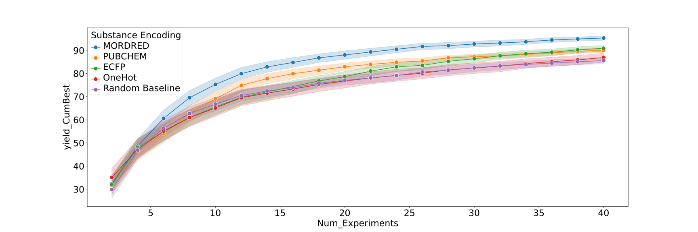

<div align="center">
  <br/>

[](https://github.com/emdgroup/baybe/actions/workflows/ci.yml)
[](https://github.com/emdgroup/baybe/actions/workflows/regular.yml)
[](https://github.com/emdgroup/baybe/actions/workflows/docs.yml)

[](https://pypi.org/project/baybe/)
[](https://pypi.org/project/baybe/)
[](https://github.com/emdgroup/baybe/issues/)
[](https://github.com/emdgroup/baybe/pulls/)
[](http://www.apache.org/licenses/LICENSE-2.0)

[](https://github.com/emdgroup/baybe/)

&nbsp;
<a href="https://emdgroup.github.io/baybe/">Homepage<a/>
&nbsp;•&nbsp;
<a href="https://emdgroup.github.io/baybe/stable/userguide/userguide.html">User Guide<a/>
&nbsp;•&nbsp;
<a href="https://emdgroup.github.io/baybe/stable/_autosummary/baybe.html">Documentation<a/>
&nbsp;•&nbsp;
<a href="https://emdgroup.github.io/baybe/stable/misc/contributing_link.html">Contribute<a/>
&nbsp;
</div>

# BayBE — A Bayesian Back End for Design of Experiments

The **Bay**esian **B**ack **E**nd (**BayBE**) is a general-purpose toolbox for Bayesian Design
of Experiments, focusing on additions that enable real-world experimental campaigns.

Besides functionality to perform a typical recommend-measure loop, BayBE's highlights are:
- ✨ Custom parameter encodings: Improve your campaign with domain knowledge
- 🧪 Built-in chemical encodings: Improve your campaign with chemical knowledge
- 🎯 Single and multiple targets with min, max and match objectives
- 🎭 Hybrid (mixed continuous and discrete) spaces
- 🚀 Transfer learning: Mix data from multiple campaigns and accelerate optimization
- 🎰 Bandit models: Efficiently find the best among many options in noisy environments (e.g. A/B Testing)
- 🌎 Distributed workflows: Run campaigns asynchronously with pending experiments
- 🎓 Active learning: Perform smart data acquisition campaigns
- ⚙️ Custom surrogate models: Enhance your predictions through mechanistic understanding
- 📈 Comprehensive backtest, simulation and imputation utilities: Benchmark and find your best settings
- 📝 Fully typed and hypothesis-tested: Robust code base
- 🔄 All objects are fully de-/serializable: Useful for storing results in databases or use in wrappers like APIs


## ⚡ Quick Start

Let us consider a simple experiment where we control three parameters and want to
maximize a single target called `Yield`.

First, install BayBE into your Python environment: 
```bash 
pip install baybe 
``` 
For more information on this step, see our
[detailed installation instructions](#installation).

### Defining the Optimization Objective

In BayBE's language, the `Yield` can be represented as a `NumericalTarget`,
which we wrap into a `SingleTargetObjective`:

```python
from baybe.targets import NumericalTarget
from baybe.objectives import SingleTargetObjective

target = NumericalTarget(
    name="Yield",
    mode="MAX",
)
objective = SingleTargetObjective(target=target)
```
In cases where we are confronted with multiple (potentially conflicting) targets,
the `DesirabilityObjective` can be used instead. It allows to define additional
settings, such as how these targets should be balanced.
For more details, see the
[objectives section](https://emdgroup.github.io/baybe/stable/userguide/objectives.html)
of the user guide.

### Defining the Search Space

Next, we inform BayBE about the available "control knobs", that is, the underlying
system parameters we can tune to optimize our targets. This also involves specifying 
their values/ranges and other parameter-specific details.

For our example, we assume that we can control three parameters – `Granularity`,
`Pressure[bar]`, and `Solvent` – as follows:

```python
from baybe.parameters import (
    CategoricalParameter,
    NumericalDiscreteParameter,
    SubstanceParameter,
)

parameters = [
    CategoricalParameter(
        name="Granularity",
        values=["coarse", "medium", "fine"],
        encoding="OHE",  # one-hot encoding of categories
    ),
    NumericalDiscreteParameter(
        name="Pressure[bar]",
        values=[1, 5, 10],
        tolerance=0.2,  # allows experimental inaccuracies up to 0.2 when reading values
    ),
    SubstanceParameter(
        name="Solvent",
        data={
            "Solvent A": "COC",
            "Solvent B": "CCC",  # label-SMILES pairs
            "Solvent C": "O",
            "Solvent D": "CS(=O)C",
        },
        encoding="MORDRED",  # chemical encoding via mordred package
    ),
]
```

For more parameter types and their details, see the
[parameters section](https://emdgroup.github.io/baybe/stable/userguide/parameters.html)
of the user guide.

Additionally, we can define a set of constraints to further specify allowed ranges and
relationships between our parameters. Details can be found in the
[constraints section](https://emdgroup.github.io/baybe/stable/userguide/constraints.html) of the user guide.
In this example, we assume no further constraints.

With the parameter definitions at hand, we can now create our
`SearchSpace` based on the Cartesian product of all possible parameter values:

```python
from baybe.searchspace import SearchSpace

searchspace = SearchSpace.from_product(parameters)
```

See the [search spaces section](https://emdgroup.github.io/baybe/stable/userguide/searchspace.html)
of our user guide for more information on the structure of search spaces
and alternative ways of construction. 

### Optional: Defining the Optimization Strategy

As an optional step, we can specify details on how the optimization should be
conducted. If omitted, BayBE will choose a default setting.

For our example, we combine two recommenders via a so-called meta recommender named
`TwoPhaseMetaRecommender`:

1. In cases where no measurements have been made prior to the interaction with BayBE,
   a selection via `initial_recommender` is used.
2. As soon as the first measurements are available, we switch to `recommender`.

For more details on the different recommenders, their underlying algorithmic
details, and their configuration settings, see the
[recommenders section](https://emdgroup.github.io/baybe/stable/userguide/recommenders.html)
of the user guide.

```python
from baybe.recommenders import (
    BotorchRecommender,
    FPSRecommender,
    TwoPhaseMetaRecommender,
)

recommender = TwoPhaseMetaRecommender(
    initial_recommender=FPSRecommender(),  # farthest point sampling
    recommender=BotorchRecommender(),  # Bayesian model-based optimization
)
```

### The Optimization Loop

We can now construct a campaign object that brings all pieces of the puzzle together:

```python
from baybe import Campaign

campaign = Campaign(searchspace, objective, recommender)
```

With this object at hand, we can start our experimentation cycle.
In particular:

* We can ask BayBE to `recommend` new experiments.
* We can `add_measurements` for certain experimental settings to the campaign's 
  database.

Note that these two steps can be performed in any order.
In particular, available measurements can be submitted at any time and also several 
times before querying the next recommendations.

```python
df = campaign.recommend(batch_size=3)
print(df)
```

```none
   Granularity  Pressure[bar]    Solvent
15      medium            1.0  Solvent D
10      coarse           10.0  Solvent C
29        fine            5.0  Solvent B
```

Note that the specific recommendations will depend on both the data
already fed to the campaign and the random number generator seed that is used.

After having conducted the corresponding experiments, we can add our measured
targets to the table and feed it back to the campaign:

```python
df["Yield"] = [79.8, 54.1, 59.4]
campaign.add_measurements(df)
```

With the newly arrived data, BayBE can produce a refined design for the next iteration.
This loop would typically continue until a desired target value has been achieved in
the experiment.

### Advanced Example: Chemical Substances
BayBE has several modules to go beyond traditional approaches. One such example is the
use of custom encodings for categorical parameters. Chemical encodings for substances
are a special built-in case of this that comes with BayBE.

In the following picture you can see
the outcome for treating the solvent, base and ligand in a direct arylation reaction
optimization (from [Shields, B.J. et al.](https://doi.org/10.1038/s41586-021-03213-y)) with
chemical encodings compared to one-hot and a random baseline:


(installation)=
## 💻 Installation
### From Package Index
The easiest way to install BayBE is via PyPI:

```bash
pip install baybe
```

A certain released version of the package can be installed by specifying the
corresponding version tag in the form `baybe==x.y.z`.

### From GitHub
If you need finer control and would like to install a specific commit that has not been
released under a certain version tag, you can do so by installing BayBE directly from
GitHub via git and specifying the corresponding
[git ref](https://pip.pypa.io/en/stable/topics/vcs-support/#git).

For instance, to install the latest commit of the main branch, run:

```bash
pip install git+https://github.com/emdgroup/baybe.git@main
```


### From Local Clone

Alternatively, you can install the package from your own local copy.
First, clone the repository, navigate to the repository root folder, check out the
desired commit, and run:

```bash
pip install .
```

A developer would typically also install the package in editable mode ('-e'),
which ensures that changes to the code do not require a reinstallation.

```bash
pip install -e .
```

If you need to add additional dependencies, make sure to use the correct syntax
including `''`:

```bash
pip install -e '.[dev]'
```

### Optional Dependencies
There are several dependency groups that can be selected during pip installation, like
```bash
pip install 'baybe[test,lint]' # will install baybe with additional dependency groups `test` and `lint`
```
To get the most out of `baybe`, we recommend to install at least
```bash
pip install 'baybe[chem,simulation]'
```

The available groups are:
- `chem`: Cheminformatics utilities (e.g. for the `SubstanceParameter`).
- `docs`: Required for creating the documentation.
- `examples`: Required for running the examples/streamlit.
- `lint`: Required for linting and formatting.
- `mypy`: Required for static type checking.
- `onnx`: Required for using custom surrogate models in [ONNX format](https://onnx.ai).
- `polars`: Required for optimized search space construction via [Polars](https://docs.pola.rs/)
- `simulation`: Enabling the [simulation](https://emdgroup.github.io/baybe/stable/_autosummary/baybe.simulation.html) module.
- `test`: Required for running the tests.
- `dev`: All of the above plus `tox` and `pip-audit`. For code contributors.

## 📡 Telemetry
BayBE collects anonymous usage statistics **only** for employees of Merck KGaA, 
Darmstadt, Germany and/or its affiliates. The recording of metrics is turned off for
all other users and is impossible due to a VPN block. In any case, the usage statistics
do **not** involve logging of recorded measurements, targets/parameters or their names
or any project information that would allow for reconstruction of details. The user and
host machine names are anonymized with via truncated hashing.
- You can verify the above statements by studying the open-source code in the
  `telemetry` module.
- You can always deactivate all telemetry by setting the environment variable 
  `BAYBE_TELEMETRY_ENABLED` to `false` or `off`. For details please consult
  [this page](https://emdgroup.github.io/baybe/stable/userguide/envvars.html#telemetry).
- If you want to be absolutely sure, you can uninstall internet related packages such
  as `opentelemetry*` or its secondary dependencies from the environment. Due to the
  inability of specifying opt-out dependencies, these are installed by default, but the
  package works without them.

## 👨🏻‍🔧 Maintainers

- Martin Fitzner (Merck KGaA, Darmstadt, Germany), [Contact](mailto:martin.fitzner@merckgroup.com), [Github](https://github.com/Scienfitz)
- Adrian Šošić (Merck Life Science KGaA, Darmstadt, Germany), [Contact](mailto:adrian.sosic@merckgroup.com), [Github](https://github.com/AdrianSosic)
- Alexander Hopp (Merck KGaA, Darmstadt, Germany) [Contact](mailto:alexander.hopp@merckgroup.com), [Github](https://github.com/AVHopp)


## 🛠️ Known Issues
A list of know issues can be found [here](https://emdgroup.github.io/baybe/stable/known_issues.html).


## 📄 License

Copyright 2022-2024 Merck KGaA, Darmstadt, Germany
and/or its affiliates. All rights reserved.

Licensed under the Apache License, Version 2.0 (the "License");
you may not use this file except in compliance with the License.
You may obtain a copy of the License at

    http://www.apache.org/licenses/LICENSE-2.0

Unless required by applicable law or agreed to in writing, software
distributed under the License is distributed on an "AS IS" BASIS,
WITHOUT WARRANTIES OR CONDITIONS OF ANY KIND, either express or implied.
See the License for the specific language governing permissions and
limitations under the License.
