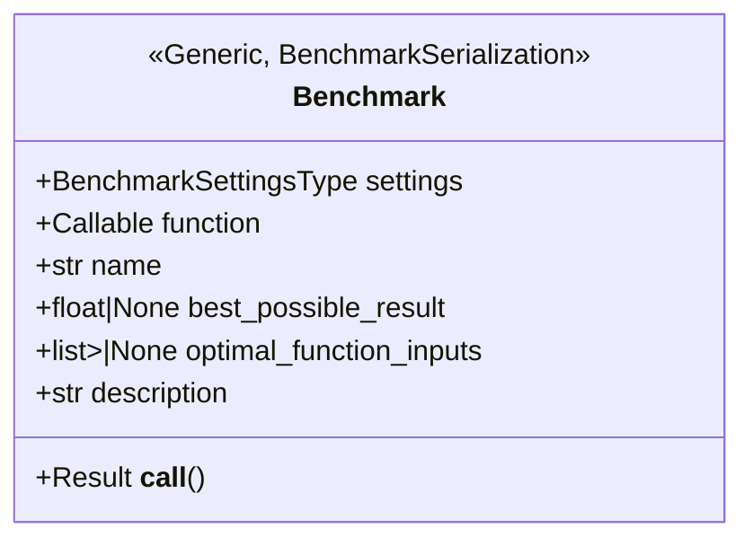
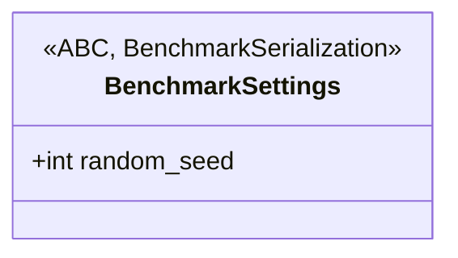
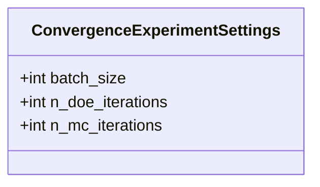
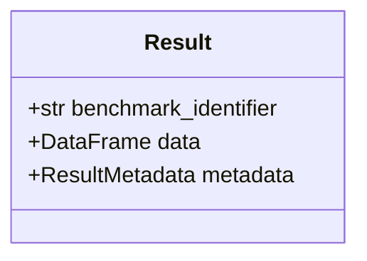
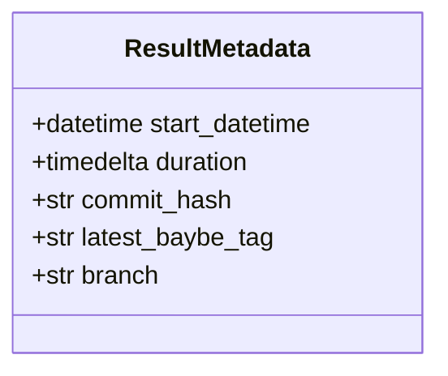

# Description

This folder contains benchmark running scenarios and their resulting outputs continuously. If you want to execute them, you can do so by using the following command:

```bash
python -m benchmarks
```

The benchmarking module relies on callables that encapsulate the usage of BayBE code in general. The callables are defined in the domains folder, where each domain and every benchmark case has its own file. This file contains the complete definition and all components of a benchmark and is the place where benchmark-related objects, as well as BayBE-related code, are defined. The following components are relevant for a benchmark:

## Benchmarking Structure

The following describes the structure and logic of the benchmarking module, followed by an example of how to create a benchmark.

### Benchmark



The final benchmark object used for execution holds all relevant information based on the benchmark, covering human-readable information about the domain and the actual benchmarking function. It can be parameterized by the `BenchmarkSettingsType`, which is a generic type defined during runtime and is limited to being a subtype of `BenchmarkSettings` to ensure it covers the minimum necessary information within the added settings subtype class. The `Callable` object is the actual function that performs the benchmarking and contains the BayBE code. It receives an object of the `BenchmarkSettingsType` as input, meaning the input type for the provided function must match the type used for `BenchmarkSettingsType` during the respective benchmark object's creation. The name serves as the unique identifier of the benchmark, and the description is intended to be human-understandable. Note that this identifier is also used to store the results; therefore, any change will be considered a new benchmark. The `best_possible_result` and `optimal_function_inputs` are optional and can provide additional information about the benchmark's domain. The `best_possible_result` is the best achievable result based on the optimization problem, depending on the optimization goal, often referred to as the global minimum or maximum. The `optimal_function_inputs` are a list of input vectors that result in the `best_possible_result` when provided to the lookup function or selected from the DataFrame of the optimization process. The description is a human-readable representation of the benchmark's task, which can provide additional information without restrictions or coupling based on result persistence. Currently, the description is automatically generated based on the `__doc__` attribute of the `function` callable. The `__call__` method is used to execute the benchmark and return the result object. The structure of the result is described under [Result](#result).

### BenchmarkSettings



The settings object is used to parameterize the benchmark. It is an abstract base class that can be extended by the user to provide additional information for the benchmark. The only required attribute is `random_seed`, which is used to seed the entire call of the benchmark function. A subtype of the class can be used to provide more information to the benchmark function and can be added as needed for a specific benchmarking task. Additional setting types can be added to reflect parameterization for the benchmarking callable. Currently, the following settings are available:

#### ConvergenceExperimentSettings



The settings object is used to parameterize the convergence experiment benchmarks and holds information about the batch size, the number of design of experiment iterations, and the number of Monte Carlo iterations, which can be used for BayBE scenario executions. Please refer to the BayBE documentation for more information about experiment simulations.

### Result



The result object encapsulates all execution-relevant information of the benchmark and represents the result of the benchmark function, along with state information at the time of execution. The `benchmark_identifier` is a unique identifier for the benchmark and is used to store the results. The `data` attribute is a pandas DataFrame that holds the actual results of the benchmark function, which represents the optimization loop. The `metadata` attribute is a `ResultMetadata` object that contains additional information about the benchmark execution.

#### ResultMetadata



The metadata is the wrapper to hold the described information about the benchmark runtime. The `start_datetime` is the time when the benchmark was started, the `duration` is the time the benchmark took to execute, the `commit_hash` is the hash of the commit that was used to execute the benchmark, the `latest_baybe_tag` is the tag of the latest BayBE release from the checked out code state that was used to execute the benchmark and the `branch` is the branch of the BayBE repository that was used to execute the benchmark. A combination of the benchmark identifier and the metadata is meant to describe the conducted result uniquely under the assumption that equal benchmarked code states are also equally representative due to the fixed random seed.

### Example

Benchmarking definitions are stored in the `domains` folder.  If a new benchmark is to be created, a new file should be created in the `domains` folder with a reasonable name that describes the benchmark. We will illustrate the creation of the `synthetic_2C1D_1C` benchmark which can be found already in the `domains` folder. We will focus on every component of the code there and explain the structure and logic of the benchmarking module.
The full code of the benchmark can be found in the `domains/synthetic_2C1D_1C.py` file.

#### Callable

The callable is the function meant to be containing BayBE code. Since we use the setting object `ConvergenceExperimentSettings` for this benchmark, the function got such a setting parameter as an input variable. The function should return a pandas DataFrame that contains the results of the benchmark. In this example we use the `simulate_scenarios` function to run the benchmark. The docstring is used as the description.  The function is defined as follows:

```python
def synthetic_2C1D_1C(settings: ConvergenceExperimentSettings) -> DataFrame:
    """Hybrid synthetic test function.

    Inputs:
        z   discrete   {1,2,3,4}
        x   continuous [-2*pi, 2*pi]
        y   continuous [-2*pi, 2*pi]
    Output: continuous
    Objective: Maximization
    Optimal Inputs:
        {x: 1.610, y: 1.571, z: 3}
        {x: 1.610, y: -4.712, z: 3}
    Optimal Output: 4.09685
    """
    parameters = [
        NumericalContinuousParameter("x", (-2 * pi, 2 * pi)),
        NumericalContinuousParameter("y", (-2 * pi, 2 * pi)),
        NumericalDiscreteParameter("z", (1, 2, 3, 4)),
    ]

    objective = NumericalTarget(name="target", mode=TargetMode.MAX).to_objective()
    search_space = SearchSpace.from_product(parameters=parameters)

    scenarios: dict[str, Campaign] = {
        "Random Recommender": Campaign(
            searchspace=search_space,
            recommender=RandomRecommender(),
            objective=objective,
        ),
        "Default Recommender": Campaign(
            searchspace=search_space,
            objective=objective,
        ),
    }

    return simulate_scenarios(
        scenarios,
        _lookup,
        batch_size=settings.batch_size,
        n_doe_iterations=settings.n_doe_iterations,
        n_mc_iterations=settings.n_mc_iterations,
        impute_mode="error",
    )
```

Where the lookup is another function in the same file. You are free to define the function as you like, as long as it gets the right input according to the benchmarks object definition which will be covered next and return a pandas DataFrame that contains the results of the benchmark.

#### Benchmark Object Construction

The benchmark gets the respective settings which is why the first object created is of type `ConvergenceExperimentSettings`. This will be add by the benchmark itself when calling your defined callable, which is why the `settings` parameter get the object `benchmark_config`. The `best_possible_result` and `optimal_function_inputs` are optional and can be used to provide additional information about the benchmarks domain. To link your defined callable with the benchmark code, the `function` parameter gets the callable object. The `name` of the function is set as the benchmarks unique identifier automatically.

```python
benchmark_config = ConvergenceExperimentSettings(
    batch_size=5,
    n_doe_iterations=30,
    n_mc_iterations=50,
)

synthetic_2C1D_1C_benchmark = Benchmark(
    function=synthetic_2C1D_1C,
    best_possible_result=4.09685,
    settings=benchmark_config,
    optimal_function_inputs=[
        {"x": 1.610, "y": 1.571, "z": 3},
        {"x": 1.610, "y": -4.712, "z": 3},
    ],
)
```

`ConvergenceExperimentSettings` is just an example type and can be varied as needed.

#### Add your benchmark to the benchmarking module

In the last step, your benhcmark object has to be added to the benchmarking module. This is done by adding the object to the `BENCHMARKS` list in the `__init__.py` file in the `domains` folder. The `BENCHMARKS` list is a list of all benchmark objects that should be executed when running the benchmarking module. You can simply import your benchmark object (here it is `synthetic_2C1D_1C_benchmark`) and add it to the list. The `__init__.py` file should look like this:

```python
[...]
from benchmarks.domains.synthetic_2C1D_1C import synthetic_2C1D_1C_benchmark

BENCHMARKS: list[Benchmark] = [
    synthetic_2C1D_1C_benchmark,
]
[...]
```

Then, the benchmark can be executed by the loop under `__main__` in the `benchmarks` module.

## Persisting Results

Results are stored automatically. Since multiple storage types are provided with different requirements and compatibilities, therefore the `PathConstructor` class is used to construct the identifier for the file. The path is automatically constructed and consists of data which describes the benchmarking result uniquely. For example `S3ObjectStorage` is used to store the results in an S3 bucket which separates the key by `/` (`<benchmark_name>/<branch>/<latest_baybe_tag>/<execution-date>/<commit_hash>/result.json`) but does not create real folders while the usual local persistence creates a file with a `_` so that folder creation is not necessary (`<benchmark_name>_<branch>_<latest_baybe_tag>_<execution-date>_<commit_hash>_result.json`). The class handling the storage of the resulting object get this `PathConstructor` and use it in the way it needs the identifier to be. There are currently two storage types available:

### LocalFileObjectStorage

Stores a file on the local file system and will automatically be chosen when calling the module if it does not run in the CI/CD pipeline. A prefix folder path can be provided when creating the object. The file will be stored in the current working directory if no prefix is provided. The file will be stored in the following format with the prefix: `<PREFIX_PATH>/<benchmark_name>_<branch>_<latest_baybe_tag>_<execution-date>_<commit_hash>_result.json`.

### S3ObjectStorage

Stores a file in an S3 bucket and will automatically be chosen when calling the module if it runs in the CI/CD pipeline. The credentials for boto3 are loaded automatically from the environment variables. For further information on how to set up the environment variables, please refer to the boto3 documentation. For locating the S3-Bucket to persist, the environment variable `BAYBE_BENCHMARKING_PERSISTENCE_PATH` must be set accordingly. For running the benchmarking module in the CI/CD pipeline, there must be also the possibility to assume a AWS role from a job call. This is done by providing the roles ARN in the secret `AWS_ROLE_TO_ASSUME`. For creating temporary credentials, a GitHub App will be used. To generated a token, the id of the GitHub App and its secret key must be provided in the secrets `APP_ID` and `APP_PRIVATE_KEY`. The file will be stored in the following format: `<benchmark_name>/<branch>/<latest_baybe_tag>/<execution-date>/<commit_hash>/result.json`.
