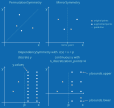

# Symmetry
{class}`~baybe.symmetries.base.Symmetry` is a concept tied to the structure of the searchspace.
It is thus closely related to a {class}`~baybe.constraints.base.Constraint`, but has a
different purpose in BayBE:
- **Constraint**: Excludes parts of the searchspace from recommendation. If a problem
  shows invariance, you can use constraints to exclude redundant regions from the search.
- **Symmetry**: Influences the way the problem is modeled. This can be applied
  independently of constraints in two ways:
  - Via [data augmentation](#data-augmentation), by assigning symmetries to a
    recommender.
  - Via [invariant kernels](#invariant-kernels), by assigning symmetries to a
    Gaussian process surrogate.

For an example of the influence of constraints, data augmentation and invariant kernels
on the optimization of a permutation invariant function,
[see here](/examples/Symmetries/permutation).

## Definitions
The following table summarizes available symmetries in BayBE:

| Symmetry                                                   | Functional Definition                                                                                                                            | Corresponding Constraint                                                                           |
|:-----------------------------------------------------------|:-------------------------------------------------------------------------------------------------------------------------------------------------|:---------------------------------------------------------------------------------------------------|
| {class}`~baybe.symmetries.permutation.PermutationSymmetry` | $f(x,y) = f(y,x)$                                                                                                                                | {class}`~baybe.constraints.discrete.DiscretePermutationInvarianceConstraint`                       |
| {class}`~baybe.symmetries.dependency.DependencySymmetry`   | $f(x,y) = \begin{cases}g(x,y) & \text{if }c(x) \\h(x) & \text{otherwise}\end{cases}$<br>where $c(x)$ is a condition that is either true or false | {class}`~baybe.constraints.discrete.DiscreteDependenciesConstraint`                                |
| {class}`~baybe.symmetries.mirror.MirrorSymmetry`           | $f(c+x,y) = f(c-x,y)$<br>where $c$ is the mirror point                                                                                          | No constraint is available. Instead, the number range for that parameter can simply be restricted. |

A {class}`~baybe.symmetries.permutation.PermutationSymmetry` can contain several
permutation groups of equal length. All groups are then permuted in lockstep, i.e.
with the same permutation. For instance, the groups `[["x1", "x2"], ["w1", "w2"]]`
express that $f(x_1,x_2,w_1,w_2) = f(x_2,x_1,w_2,w_1)$.

## Data Augmentation
This can be a powerful tool to improve the modeling process. Data augmentation
essentially changes the data that the model is fitted on by adding more points. The 
augmented points are constructed such that they represent a symmetric point compared
with their original, which always corresponds to a different transformation depending
on which symmetry is responsible.

If the surrogate model receives such augmented points, it can learn the symmetry. This
has the advantage that it can improve predictions for unseen points and is fully 
model-agnostic. Downsides are increased training time and potential computational 
challenges arising from a fit on substantially more points. Data augmentation is
controlled by assigning symmetries to the
{attr}`~baybe.recommenders.pure.bayesian.base.BayesianRecommender.symmetries`
attribute of the recommender.

Below we illustrate the effect of data augmentation for the different symmetries
supported by BayBE:



(invariant_kernels)=
## Invariant Kernels
Some machine learning models can be constructed with architectures that automatically
respect a symmetry, i.e. applying the model to an augmented point always produces the
same output as the original point by construction. For Gaussian processes, this is
achieved via special kernels, which BayBE constructs automatically when symmetries are
assigned to the
{attr}`~baybe.surrogates.gaussian_process.core.GaussianProcessSurrogate.symmetries`
attribute of the surrogate:

```python
from baybe.recommenders import BotorchRecommender
from baybe.surrogates import GaussianProcessSurrogate
from baybe.symmetries import MirrorSymmetry, PermutationSymmetry

surrogate = GaussianProcessSurrogate(
    symmetries=[PermutationSymmetry([["x1", "x2"]]), MirrorSymmetry("x3")]
)
recommender = BotorchRecommender(surrogate_model=surrogate)

# Presets can be combined with symmetries as well
surrogate = GaussianProcessSurrogate.from_preset(
    "CHEN", symmetries=[MirrorSymmetry("x3")]
)
```

The kernel $k$ of the Gaussian process is first resolved as usual, i.e. including all
{ref}`parameter-specific kernel overrides <parameter_kernel_overrides>` and the task
kernel in [transfer learning](/concepts/transfer_learning) settings. It is then made
invariant under the symmetries as described below, operating on the normalized model
inputs $x$ and $x'$. Since the posterior of a Gaussian process is determined by its
kernel and mean function, its predictions are then exactly invariant, regardless of the
hyperparameters found during model fitting.

### Permutation
The kernel is summed over all permutations $\pi$ of its second input, where the groups
of a {class}`~baybe.symmetries.permutation.PermutationSymmetry` are permuted in
lockstep:

$$k_{\text{perm}}(x,x') = \sum_{\pi} k(x, \pi x')$$

This is a valid kernel only if $k$ treats all permuted positions alike. BayBE ensures
this by sharing the hyperparameters of the permuted parameters, e.g. the lengthscales of
their input dimensions or the hyperparameters of their equivalent kernel overrides.
Shared hyperparameters still receive their prior once per position, exactly as if they
were not shared. A group of $n$ positions requires $n!$ kernel evaluations.

### Mirror
The kernel is summed over the reflections $m(x)$ of both inputs at the mirror point $c$,
i.e. $m$ maps the mirrored parameter value $v$ to $2c - v$:

$$k_{\text{mirror}}(x,x') = k(x,x') + k(x,m(x')) + k(m(x),x') + k(m(x),m(x'))$$

This construction is valid for any kernel and requires four kernel evaluations.
Reflections that leave the parameter range are unproblematic.

### Dependency
Each input has an activity pattern $P(x)$, which indicates for every
{class}`~baybe.symmetries.dependency.DependencySymmetry` whether its condition holds.
For a pattern $P$, let $x_P$ denote the input with the affected parameters of all
dependencies inactive in $P$ fixed to a constant. Only inputs with equal patterns are
correlated:

$$k_{\text{dep}}(x,x') = \sum_{P} \mathbb{1}[P(x) = P]\, \mathbb{1}[P(x') = P]\, k(x_P,x'_P)$$

Two inputs with an inactive dependency are thus compared as if their affected
parameters were equal, so their values do not matter. Since inputs with different
patterns are uncorrelated, the constant is never compared with an actual value. The
causing parameter itself is not fixed, so that different values that make a dependency
inactive can still be distinguished. All patterns share the same kernel and
hyperparameters, and $D$ dependencies require $2^D$ kernel evaluations. The
{attr}`~baybe.symmetries.dependency.DependencySymmetry.n_discretization_points` setting
is only relevant for data augmentation.

```{admonition} Requirements and Limitations
:class: warning
* Each parameter can be controlled by at most one symmetry, where the controlled
  parameters are the permuted, mirrored and affected ones. The causing parameter of a
  dependency cannot be controlled by any symmetry.
* Symmetries can only involve regular parameters, e.g. no
  {class}`~baybe.parameters.categorical.TaskParameter`.
* Permutation groups can have at most five positions. The costs of several symmetries
  multiply.
* The kernel must be able to treat permuted parameters alike. For instance, permuted
  parameters with different kernel overrides or a kernel restricted to only some of
  them raise an error.
* For dependencies, the computational representation of the causing parameter must
  reveal whether a dependency is active, which can be violated by decorrelated
  encodings.
* The mean function must be constant (or constant per task in transfer learning),
  since otherwise the predictions are not invariant.
* The inner models of the
  {class}`~baybe.surrogates.transfer_learning.rgpe.RGPESurrogate` use the symmetries of
  their base Gaussian process.
```

## Comparison
### General
The following table summarizes the general differences between both approaches:

|                           | Data Augmentation                                                                   | Invariant Kernels                                                                                     |
|:--------------------------|:------------------------------------------------------------------------------------|:------------------------------------------------------------------------------------------------------|
| Configured via            | {attr}`~baybe.recommenders.pure.bayesian.base.BayesianRecommender.symmetries`        | {attr}`~baybe.surrogates.gaussian_process.core.GaussianProcessSurrogate.symmetries`                   |
| Applicable surrogates     | Any                                                                                 | Gaussian processes only                                                                               |
| How the symmetry enters   | Additional training points                                                          | Kernel structure                                                                                      |
| Invariance of predictions | Approximate, learned from data                                                      | Exact, by construction                                                                                |
| Training data             | Grows                                                                               | Unchanged                                                                                             |
| Additional costs          | Fitting on more points                                                              | More expensive kernel evaluations                                                                     |
| Restrictions              | Validation against the search space                                                 | Additional [requirements](#invariant-kernels)                                                         |

Both approaches can be configured at the same time, which is valid but redundant.

### Per Symmetry
The following table compares both approaches for the individual symmetries:

| Symmetry                                                   | Data Augmentation                                                                                                                                                                                           | Invariant Kernel                                                            |
|:-----------------------------------------------------------|:------------------------------------------------------------------------------------------------------------------------------------------------------------------------------------------------------------|:----------------------------------------------------------------------------|
| {class}`~baybe.symmetries.permutation.PermutationSymmetry` | Adds all permutations of each point, i.e. up to $n!$ points per measurement                                                                                                                                 | Sums over all permutations, i.e. $n!$ kernel evaluations                    |
| {class}`~baybe.symmetries.mirror.MirrorSymmetry`           | Adds the mirrored point, i.e. up to two points per measurement                                                                                                                                              | Sums over all reflections, i.e. four kernel evaluations                     |
| {class}`~baybe.symmetries.dependency.DependencySymmetry`   | Replaces points with inactive dependency by a grid over the affected parameters, which requires discretizing continuous parameters. The original values of continuous parameters might not be part of the grid. | Fixes the affected parameters of inactive dependencies, i.e. one kernel evaluation per activity pattern |
