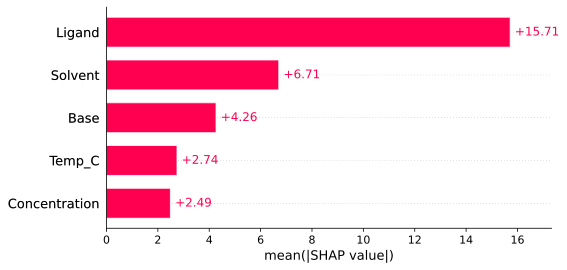
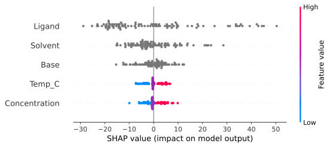
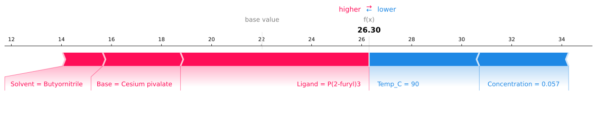
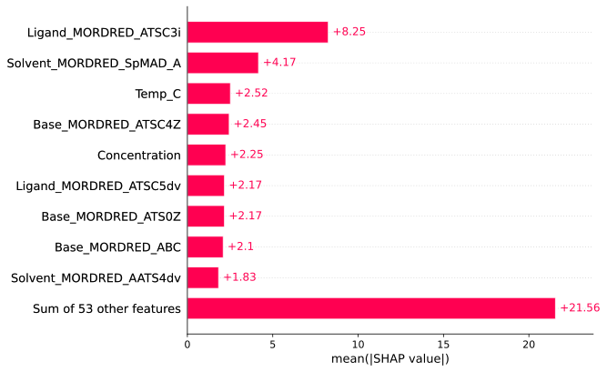
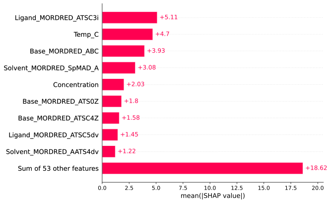

# Insights
In BayBE, insights provide a way of analyzing your experimental results beyond what is 
required for the basic measure-recommend loop.

## Parameter Importance via SHAP
[**SH**apley **A**dditive ex**P**lanations](https://shap.readthedocs.io/en/latest/index.html) 
are a popular way of interpreting models to gain insight into the importance of the 
features utilized. In the context of Bayesian optimization (BO), this enables analyzing 
the importance of the parameters that are part of the search space. This can be useful 
if it is unclear which parameters play a key role and which do not, learnings that can 
be applied in designing future campaigns. The interface is provided by the 
[`SHAPInsight`](baybe.insights.shap.SHAPInsight) class.

```{admonition} Model Interpretation in BO
:class: warning
While feature importance is a method well studied, it is generally applied in data 
regimes where models are fed with plenty of data. However, in BO, we often operate in 
the *low-to-no-data regime*, making feature importance interpretation potentially tricky. 
We urge the users to consider this and be careful with their interpretations. As 
possible avenue, we suggest a study, where the avaialble amount of data is 
sub-sampled, and the obtained parameter importances are checked for convergence and
consistency.
```

### Basic Usage
`SHAPInsights` can be obtained in several ways:
- From a [`Campaign`](baybe.campaign.Campaign) via 
  [`from_campaign`](baybe.insights.shap.SHAPInsight.from_campaign):
  ~~~python
  insight = SHAPInsight.from_campaign(campaign)
  ~~~
- From a surrogate model via [`from_surrogate`](baybe.insights.shap.SHAPInsight.from_surrogate):
  ~~~python
  insight = SHAPInsight.from_surrogate(surrogate, data)
  ~~~
- From a recommender that has an underlying surrogate model and implements 
  [`get_surrogate`](baybe.recommenders.pure.bayesian.base.BayesianRecommender.get_surrogate) 
  via [`from_recommender`](baybe.insights.shap.SHAPInsight.from_recommender):
  ~~~python
  insight = SHAPInsight.from_recommender(recommender, searchspace, objective, data)
  ~~~

In these examples, `data` corresponds to the background data. In general, this will be 
the measurements obtained during your experimental campaign (`from_campaign` 
automatically infers the `measurements` from the `campaign` object).

```{admonition} Results Shown Here
:class: note
In what follows, we show results from the campaign also studied in the 
[full lookup example](./../../examples/Backtesting/full_lookup). This aims at 
maximizing the yield of a chemical reaction and involves 3 substance parameters and 2 
numerical parameters. We randomly sampled 100 measurements from the lookup table and 
added them to the campaign, providing a basis for reating a `SHAPInsight`.
```

### Plots
After creating the insight, various methods are available to visualize the results. 
~~~python
insight.plot("bar")
~~~

This result agrees well with the chemical intuition that ligands are the most important 
reactants to activate the conversion resulting in higher yields.

A subset of SHAP plots is available via the [.plot](baybe.insights.shap.SHAPInsight.plot) 
interface, please refer to [available SHAP plots](baybe.insights.shap.SHAP_PLOTS).

This is also possible for a different data set that is not identical to the background 
used in generating the insight. If this is desired, pass your data frame as second 
argument:
~~~python
insight.plot("beeswarm", new_measurements)
~~~


The `force` plot type requires the user to additionally select which single data point 
they want to visualize via `explanation_index`:
~~~python
insight.plot("force", explanation_index=3) # plots the force analysis of the fourth measurement
~~~


### Explainers
In general, SHAP is an exhaustive method testing many subsets of models features. In 
practice, this means that the exhaustive algorithm (called `ExactExplainer`) is 
unfeasible, and various approximate variants are available, see 
[supported explainers](baybe.insights.shap.EXPLAINERS). For details about their inner 
mechanics, we refer to the [SHAP documentation](https://shap.readthedocs.io/en/latest/api.html#explainers).

The explainer can be changed when creating the insight:
~~~python
insight = SHAPInsight.from_campaign(campaign, explainer_cls="KernelExplainer") # default explainer
~~~

### Experimental and Computational Representations
`SHAPInsight` by default analyzes the experimental representation of the measurements, 
i.e. the one relevant for the actual experiments. However, this comes with limitations.

```{admonition} Experimental Representation Limits
:class: warning
If the experimental representation contains parameters with non-numeric values (such 
as [CategoricalParameter](baybe.parameters.categorical.CategoricalParameter), 
[SubstanceParameter](baybe.parameters.substance.SubstanceParameter) 
or [CustomDiscreteParameter](baybe.parameters.custom.CustomDiscreteParameter)), 
the only suported explainer is the `KernelExplainer`. Other explainers will result in 
[IncompatibleExplainerError](baybe.exceptions.IncompatibleExplainerError).
```

A feature importance study can still be performed by looking at the computational 
representation of the data points, activated by `use_comp_rep`. Since in this 
representation, all entries are numeric by default, there are no limitations on the 
explainer type used. A study of the computational representation might also be useful, 
if a deeper analysis of descriptors used is interesting to the user. In general, for 
each non-numerical parameter in the experimental representation, there will be several 
descriptors the computational representation: 
~~~python
insight = SHAPInsight.from_campaign(campaign, use_comp_rep=True)
insight.plot("bar")
~~~


In addition to SHAP-based explainers, we also support 
[LIME](https://arxiv.org/abs/1602.04938) and 
[MAPLE](https://papers.nips.cc/paper_files/paper/2018/hash/b495ce63ede0f4efc9eec62cb947c162-Abstract.html) 
variants, e.g.:
~~~python
insight = SHAPInsight.from_campaign(campaign, explainer_cls="LimeTabular", use_comp_rep=True)
insight.plot("bar")
~~~


As you can see, the result from `LimeTabular` are very similar to the results from the 
SHAP `KernelExplainer` because both methods involve linear local approximations.