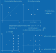

# Symmetry
{class}`~baybe.symmetry.Symmetry` is a concept tied to the structure of the searchspace.
It is thus closely related to a {class}`~baybe.constraints.base.Constraint`, but has a
different purpose in BayBE. If the searchspace is symmetric in any sense, you can
exclude the degenerate parts via a constraint. But this would not change the modeling
process. The role of a {class}`~baybe.symmetry.Symmetry` is exactly this: Influence how
the surrogate model is constructed to include the knowledge about the symmetry. This 
can be applied independently of constraints. For an example of the influence of 
symmetries and constraints for a permutation invariant situation,
[see here](/examples/Symmetries/permutation).

## Definitions
The following table summarizes available symmetries in BayBE:

| Symmetry                                     | Functional Definition                                                                                                                            | Corresponding Constraint                                                                           | 
|:---------------------------------------------|:-------------------------------------------------------------------------------------------------------------------------------------------------|:---------------------------------------------------------------------------------------------------|
| {class}`~baybe.symmetry.PermutationSymmetry` | $f(x,y) = f(y,x)$                                                                                                                                | {class}`~baybe.constraints.discrete.DiscretePermutationInvarianceConstraint`                       |
| {class}`~baybe.symmetry.DependencySymmetry`  | $f(x,y) = \begin{cases}f(x,y) & \text{if }c(x) \\f(x) & \text{otherwise}\end{cases}$<br>where $c(x)$ is a condition that is either true or false | {class}`~baybe.constraints.discrete.DiscreteDependenciesConstraint`                                |
| {class}`~baybe.symmetry.MirrorSymmetry`      | $f(x,y) = f(-x,y)$                                                                                                                               | No constraint is available. Instead, the number range for that parameter can simply be restricted. | 

## Data Augmentation
This can be a powerful tool to improve the modeling process. Data augmentation
essentially changes the data that the model is fitted on by adding more points. The 
augmented points are constructed such that they represent a symmetric point compared
with their original, which always corresponds to a different transformation depending
on which symmetry is responsible.

If the surrogate model receives such augmented points, it can learn the symmetry. This
has the advantage that it can improve predictions for unseen points and is fully 
model-agnostic. Downsides are increased training times and potential computational 
challenges arising form a fit on substantially more points. It is thus possible to 
control the data augmentation behavior of any {class}`~baybe.symmetry.Symmetry` by 
setting its {attr}`~baybe.symmetry.Symmetry.use_data_augmentation` attribute
(`True` by default).

Below we illustrate the effect of data augmentation for the different symmetries
supported by BayBE:



## Invariant Kernels
Sme machine learning models can be constructed in their architecture so that they 
automatically respect a certain symmetry, i.e. applying the model to an augmented point 
always produces the same output as the original point.

For Gaussian processes, this can be achieved by applying special kernels.
```{admonition} Not Implemented Yet
:class: warning
Invariant kernels will be applied automatically when a corresponding symmetry has been 
configured for the surrogate model GP. This feature is not implemented yet.
```   