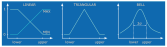

# Targets

Targets play a crucial role as the connection between observables measured in an 
experiment and the machine learning core behind BayBE.
In general, it is expected that you create one [`Target`](baybe.targets.base.Target) 
object for each of your observables. 
The way BayBE treats multiple targets is then controlled via the 
[`Objective`](../../userguide/objective).

## ``NumericalTarget``
Besides their ``name``, numerical targets have the following attributes:
* **The optimization** ``mode``: This specifies whether we want to minimize or maximize 
  the target or whether we want to match a specific value.
* **Bounds:** Define ``bounds`` that constrain the range of target values.
* **A transformation function:** When bounds are provided, a ``transformation`` is 
  used to map target values onto the [0,1] interval.

Below a visualization of possible choices for ``transformation``, where `lower` and 
`upper` are the entries provided via `bounds`:


### `MIN` and `MAX` mode
Here two examples for simple maximization and minimization targets:
```python
from baybe.targets import NumericalTarget, TargetMode, TargetTransformation

max_target = NumericalTarget(
    name='Target1',
    mode=TargetMode.MAX,  # can also be provided as string "MAX"
)

min_target = NumericalTarget(
    name='Target2',
    mode="MIN",  # can also be provided as TargetMode.MIN
    bounds=(0,100),  # optional, values < 0 are mapped to 1 and values > 100 are mapped to 0
    transformation=TargetTransformation.LINEAR  # optional, will be applied if bounds are not None
)
```

### `MATCH` mode
If you want to match a desired value, the ``TargetMode.MATCH`` mode is the right choice.
In this mode, ``bounds`` are required and different transformations compared to ``MIN`` 
and ``MAX`` modes are allowed.

Assume we want to instruct BayBE to match a value of 50 in "Target3".
We simply need to choose the bounds so that the midpoint is the desired value.
The spread of the bounds interval defines how fast the acceptability of a measurement 
falls off away from the match value, also depending on the choice of ``transformation``.

