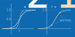

# Transformations

Transformations allow you to customize the way numerical quantities enter the
recommendation process. They can be used to express various optimization objectives and
imprint your domain knowledge or use case requirements on the quantities being
optimized. See, for example, the [targets user guide](./targets) to learn how to do
this.

```{admonition} Current Scope
:class: note
Currently, transformations are only used for the
{class}`~baybe.targets.numerical.NumericalTarget` class but it is planned to enable
their use for parameters as well.
```

## Basic Transformations

The following pre-defined basic transformation types are available via the
{mod}`baybe.transformations` module: 


- {class}`~baybe.transformations.basic.IdentityTransformation`: $f(x) = x$
- {class}`~baybe.transformations.basic.AbsoluteTransformation`: $f(x) = |x|$
- {class}`~baybe.transformations.basic.ExponentialTransformation`: $f(x) = e^x$
- {class}`~baybe.transformations.basic.LogarithmicTransformation`: $f(x) = \ln(x)$
- {class}`~baybe.transformations.basic.PowerTransformation`: $f(x) = x^p$


## Advanced Transformations

In addition to the [basic transformations](#basic-transformations), the
{mod}`baybe.transformations` module provides a number of advanced transformation types
that allow for more customization:

### ClampingTransformation

The {class}`~baybe.transformations.basic.ClampingTransformation` is used to limit the
range of the input values to a specified interval.


**Transformation rule**

```{math}
f(x) =
\begin{cases}
    c_\text{min} & \text{if } x < c_\text{min} \\
    x & \text{if } c_\text{min} \leq x < c_\text{max} \\
    c_\text{max} & \text{if } c_\text{max} \leq x
\end{cases}
```
where $c_\text{min}$ and $c_\text{max}$ are the bounds specified for the transformation.

**Example**

```python
from baybe.transformations import ClampingTransformation

t_min = ClampingTransformation(min=10)  # clamps to [10, +inf)
t_max = ClampingTransformation(max=20)  # clamps to (-inf, 20]
t_both = ClampingTransformation(min=10, max=20)  # clamps to [10, 20]
```

### AffineTransformation

The {class}`~baybe.transformations.basic.AffineTransformation` applies an affine
transformation to the given input, i.e., it scales and shifts the incoming values.


**Transformation rule**

```{math}
f(x) = \begin{cases}
    & = ax + b &\quad \text{by default} \\
    & = a(x + b) &\quad \text{if } \texttt{shift_first=True}
\end{cases}
```
where $a$ is the scaling factor and $b$ is the shift value of the transformation.

**Example**

```python
from baybe.transformations import AffineTransformation

t = AffineTransformation(factor=2)  # scales by 2
t = AffineTransformation(shift=3)  # shifts by 3
t = AffineTransformation(factor=2, shift=3)  # scales, *then* shifts
t = AffineTransformation(factor=2, shift=3, shift_first=True)  # shifts, *then* scales
```

### TwoSidedAffineTransformation

The {class}`~baybe.transformations.basic.TwoSidedAffineTransformation` is a piecewise
transformation with two affine segments that meet at a midpoint.


**Transformation rule**

```{math}
f(x) =
\begin{cases}
    c_\text{left} (x - c_\text{mid}) & \text{if } x < c_\text{mid} \\
    c_\text{right} (x - c_\text{mid}) & \text{if } c_\text{mid} \leq x \\
\end{cases}
```
where $c_\text{left}$ and $c_\text{right}$ are the slopes of the left and right affine
segments, respectively, and $c_\text{mid}$ specifies the midpoint where the two
segments meet.

**Example**

```python
from baybe.transformations import TwoSidedAffineTransformation

t = TwoSidedAffineTransformation(slope_left=-1, slope_right=1)  # absolute value
t = TwoSidedAffineTransformation(slope_left=-1, slope_right=0, midpoint=1)  # hinge loss
```

### SigmoidTransformation
The {class}`~baybe.transformations.basic.SigmoidTransformation` normalizes its input
to the range $[0, 1]$ using a sigmoid function.



**Transformation rule**

```{math}
f(x) = \frac{1}{1 + e^{-a(x - c)}}
```
where $c$ is the center point where the curve crosses the value 0.5 and $a$ is a
parameter controlling the steepness. Note that the transformation can also be specified
using anchors points instead, as demonstrated below.

**Example**

```python
from baybe.transformations import SigmoidTransformation

t = SigmoidTransformation(center=0.0, steepness=1.0)  # vanilla sigmoid function
t = SigmoidTransformation(center=1.0, steepness=2.0)  # shifted and steeper
t = SigmoidTransformation.from_anchors(
    anchors=[(1, 0.1), (2, 0.9)]  # passes through anchors
)
```

### BellTransformation

The {class}`~baybe.transformations.basic.BellTransformation` passes its input through a
bell-shaped function (i.e. an **unnormalized** Gaussian). This is useful for steering
target values to specific set points.


**Transformation rule**

```{math}
f(x) = e^{-\frac{(x - c)^2}{2\sigma^2}}
```
where $c$ is the center of the bell curve and $\sigma$ is a parameter controlling its
width. The latter has the same interpretation as the standard deviation of a Gaussian
distribution except that it does not affect the magnitude of the curve.

**Example**

```python
from baybe.transformations import BellTransformation

t = BellTransformation(center=0, sigma=1)  # like an unnormalized standard normal
t = BellTransformation(center=5, sigma=2)  # twice as wide and shifted to the right by 5
```

### TriangularTransformation

The {class}`~baybe.transformations.basic.TriangularTransformation` is a piecewise affine
transformation with the shape of a triangle. This is useful for steering target values
to specific set points with symmetric or asymmetric penalty.


**Transformation rule**

```{math}
f(x) =
\begin{cases}
    0 & \text{if } x < c_\text{min} \\
    \frac{x - c_\text{min}}{c_\text{peak} - c_\text{min}} & \text{if } c_\text{min} \leq x < c_\text{peak} \\
    \frac{c_\text{max} - x}{c_\text{max} - c_\text{peak}} & \text{if } c_\text{peak} \leq x < c_\text{max} \\
    0 & \text{if } c_\text{max} \leq x
\end{cases}
```
where $c_\text{min}$ and $c_\text{max}$ are the cutoff values of the triangle,
respectively, and $c_\text{peak}$ is its peak location. Note that there also exist
convenience constructors that allow for alternative parameterizations of the
transformation, as exemplified below.

**Example**

```python
from baybe.transformations import TriangularTransformation

# Symmetric triangle with peak at 3, reaching zero at 1 and 5
t_sym1 = TriangularTransformation(cutoffs=(1, 5))
t_sym2 = TriangularTransformation.from_width(peak=3, width=4)
t_sym3 = TriangularTransformation.from_margins(peak=3, margins=(2, 2))
assert t_sym1 == t_sym2 == t_sym3

# Positively skewed triangle with peak at 2 (same cutoffs as above)
t_skew1 = TriangularTransformation(cutoffs=(1, 5), peak=2)
t_skew2 = TriangularTransformation.from_margins(peak=2, margins=(1, 3))
assert t_skew1 == t_skew2
```

## Composite Transformations

Instead of applying individual [basic](#basic-transformations) or
[advanced](#advanced-transformations) transformations directly, you can also use them as
building blocks to enable more complex types of operations. This is enabled through the
{class}`~baybe.transformations.composite.ChainedTransformation`,
{class}`~baybe.transformations.composite.AdditiveTransformation` and
{class}`~baybe.transformations.composite.MultiplicativeTransformation` classes, which
allow you to combine multiple transformations into a single one.

### Chaining

The {class}`~baybe.transformations.composite.ChainedTransformation` class represents the
mathematical concept of [function
composition](https://en.wikipedia.org/wiki/Function_composition), which allows you to
"chain" multiple transformations together. It gives you a higher-level transformation
object that applies the specified transformation steps in sequence, where the output of
one transformation serves as the input to the next.

```{admonition} Order of Operations
:class: important
Since the given transformations are applied sequentially, the order in which they are
specified matters! More specifically, the first transformation passed to
{class}`~baybe.transformations.composite.ChainedTransformation` gets applied first, then
the second, and so on. Therefore, `ChainedTransformation([f, g, h])` represent the
mathematical operation $(h \circ g \circ f)(x) = h(g(f(x)))$, where the order in the
notation is reversed.
```

```{admonition} Convenience Construction
:class: tip
Instead of explicitly calling the
{class}`~baybe.transformations.composite.ChainedTransformation` 
constructor to chain transformations, you can alternatively:
* use the overloaded pipe operator `|`  (inspired by the Unix ["pipe"](https://en.wikipedia.org/wiki/Pipeline_(Unix)) for chaining processes)
* calling an existing transformation's
{meth}`~baybe.transformations.base.Transformation.chain` method
```

```python
from baybe.transformations import (
    AffineTransformation,
    ChainedTransformation,
    PowerTransformation,
    TwoSidedAffineTransformation,
)

twosided = TwoSidedAffineTransformation(slope_left=0, slope_right=1)
power = PowerTransformation(exponent=2)
shift = AffineTransformation(shift=1)

# Create a transformation representing a shifted one-sided quadratic function:
# 1) First, we cut the left side by multiplying by zero
# 2) Then, we apply the quadratic transformation
# 3) Finally, we shift to the right
chain1 = ChainedTransformation([twosided, power, shift])  # explicit construction
chain2 = twosided | power | shift  # using overloaded pipe operator
chain3 = twosided.chain(power).chain(shift)  # via method chaining
assert chain1 == chain2 == chain3
```

(TRANSFORMATION_COMPRESSION)=
````{admonition} Compression
:class: note

BayBE is smart when it comes to chaining transformations in that it automatically
compresses the resulting chain to remove redundancies, by
* dropping unnecessary identity transformations,
* combining successive affine transformations,
* and ignoring the chaining layer for comparison operations when it's not needed. 

```python
from baybe.transformations import (
    AffineTransformation,
    ChainedTransformation,
    IdentityTransformation,
)

t1 = ChainedTransformation(
    [
        IdentityTransformation(),
        AffineTransformation(factor=2),
        AffineTransformation(shift=3),
    ]
)
t2 = (
    IdentityTransformation()
    | AffineTransformation(factor=2)
    | AffineTransformation(shift=3)
)
t3 = AffineTransformation(factor=2, shift=3)  # compressed version

assert isinstance(t1, ChainedTransformation)  # t1 is a explicitly constructed as chain
assert not isinstance(t2, ChainedTransformation)  # not a chain due to auto-compression
assert t1 == t2 == t3  # all are equal, even though t1 is a ChainedTransformation object
```
````

````{admonition} Creation from Existing Transformations
:class: tip

For common chaining operations, BayBE provides a set convenience methods that
allow you to quickly create new transformations from existing ones
(see {class}`~baybe.transformations.base.Transformation` for all options).

```python
t = IdentityTransformation()  # start with **any** existing transformation
t1 = t.abs()  # compute absolute value
t2 = t.negate()  # negate the input
t3 = t2.clamp(min=-1)  # clamp to [-1, +inf)
t4 = t3 + 5  # add a constant value
t5 = t4 * 10  # multiply by a constant factor
```
````

### Addition

The {class}`~baybe.transformations.composite.AdditiveTransformation` computes the sum
of the outputs of two transformations applied to the same input. More precisely,
`AdditiveTransformation([f, g])` computes the transformation $h(x) := f(x) + g(x)$.

```{admonition} Convenience Construction
:class: tip

Instead of explicitly calling the
{class}`~baybe.transformations.composite.AdditiveTransformation` constructor,
you can also use the overloaded `+` operator to add transformations.
```

```python
import torch
from baybe.transformations import AdditiveTransformation, PowerTransformation

p1 = PowerTransformation(exponent=2)
p2 = PowerTransformation(exponent=3)
values = torch.linspace(0, 1, steps=100)

t1 = AdditiveTransformation([p1, p2])  # explicit construction
t2 = p1 + p2  # using overloaded addition operator
assert t1 == t2
assert torch.equal(t1(values), p1(values) + p2(values)) 
```

### Multiplication

Analogous to the [additive case above](#addition), the
{class}`~baybe.transformations.composite.MultiplicativeTransformation` computes the
product of the outputs of two transformations applied to the same input. More precisely,
`MultiplicativeTransformation([f, g])` computes the transformation
$h(x) := f(x) \cdot g(x)$.

```{admonition} Convenience Construction
:class: tip

Instead of explicitly calling the
{class}`~baybe.transformations.composite.MultiplicativeTransformation` constructor,
you can also use the overloaded `*` operator to multiply transformations.
```

```python
import torch
from baybe.transformations import MultiplicativeTransformation, PowerTransformation

p1 = PowerTransformation(exponent=2)
p2 = PowerTransformation(exponent=3)
values = torch.linspace(0, 1, steps=100)

t1 = MultiplicativeTransformation([p1, p2])  # explicit construction
t2 = p1 * p2  # using overloaded multiplication operator
assert t1 == t2
assert torch.equal(t1(values), p1(values) * p2(values))
```

## Custom Transformations

If none of the pre-defined [basic](#basic-transformations) or
[advanced](#advanced-transformations) transformations fit your needs and [composing
them](#composite-transformations) does also not bring you to the desired result, you can
easily define your custom logic using the
{class}`~baybe.transformations.basic.CustomTransformation` class, which accepts any
one-argument `torch` callable as transformation function:

```python
import torch
from baybe.transformations import CustomTransformation

t = CustomTransformation(torch.sin)
```

````{admonition} Automatic Wrapping
:note:

When embedding custom transformations into another context, wrapping the `torch`
callable into a {class}`~baybe.transformations.basic.CustomTransformation` happens
automatically, so you can use them just like any other built-in transformation:

```python
import torch
from baybe.targets import NumericalTarget
from baybe.transformations import CustomTransformation

t = NumericalTarget(name="Sinusoid Target", transformation=torch.sin)
```
````

````{admonition} Chaining Custom Transformations
:class: tip

A convenient feature is that you can [chain](#chaining) custom transformations with
built-in ones directly, without needing to explicitly wrap them. Here is an example,
demonstrating the same chaining operation from the most concise to the most explicit
construction:

```python
import torch
from baybe.transformations import (
    AbsoluteTransformation,
    ChainedTransformation,
    CustomTransformation,
)

t1 = torch.sin(AbsoluteTransformation())
t2 = AbsoluteTransformation() | torch.sin
t3 = AbsoluteTransformation() | CustomTransformation(torch.sin)
t4 = AbsoluteTransformation().chain(CustomTransformation(torch.sin))
t5 = ChainedTransformation([AbsoluteTransformation(), CustomTransformation(torch.sin)])
assert t1 == t2 == t3 == t4 == t5
```
````

```{admonition} Serialization
:class: warning

Due to the arbitrary logic that can be involved, (de-)serialization
of custom transformations not supported.
```

## Equality

An important aspect to notice is that there are often many ways to represent one and the
same mathematical transformation, by following different construction paths.

While these construction paths lead to the identical input-output behavior, the
corresponding {class}`~baybe.transformations.base.Transformation` objects representing
these mappings are not necessarily equal because they rely on different building blocks
internally. While BayBE automatically [unifies](TRANSFORMATION_COMPRESSION) these
representations for trivial cases behind the scenes, it is not always possible to do so.

To demonstrate this effect, let us recreate the input-output mapping from the
[chaining](#chaining) section using a slightly different construction path:
```python
import torch

# Logically, we can achieve the same result by interchanging the first two steps:
# 1) Here, we apply the quadratic transformation first
# 2) Then, we cut as a second step
# 3) Finally, we shift
chain4 = power | twosided | shift  # different order of operations

# While these two constructions are mathematically equivalent, they are not "equal" from
# an object perspective, because they rely on different transformation steps:
values = torch.linspace(0, 2, steps=100)
assert torch.equal(chain1(values), chain4(values))  # they produce the same output
assert chain1 != chain4  # but they are not "equal" objects
```


